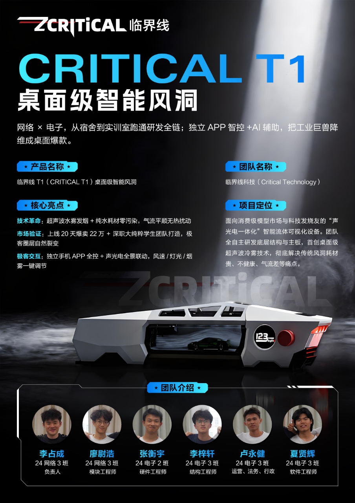

# ZCritical T1 桌面级智能风洞



> 融合超声波水雾发烟、AI辅助与独立APP智控，实现"声光电一体化"可视化流体实验体验。

## 项目结构

```
Z-T1/
├── steering/                     ← 🧠 全局文档治理（最优先）
│   ├── specs/                    ← 规范（不可变事实）
│   │   ├── project-overview.md       ← 📋 文档治理中心
│   │   ├── hardware-config.md        ← 🔧 硬件唯一真值源
│   │   ├── protocol-contract.md      ← 📡 协议唯一真值源
│   │   └── ui-design-tokens.md       ← 🎨 UI 设计令牌
│   ├── roadmap/                  ← 路线图
│   │   └── global-development-roadmap.md
│   ├── guides/                   ← 操作指南
│   │   ├── ai-proactive-guidance.md
│   │   ├── multi-session-collaboration.md
│   │   ├── naming-conventions.md
│   │   ├── git-workflow.md
│   │   ├── ux-guidelines.md
│   │   └── ui-review-checklist.md
│   ├── knowledge/                ← 参考知识
│   │   ├── known-pitfalls.md
│   │   └── troubleshooting.md
│   ├── images/                   ← 文档素材
│   │   └── critical_t1_poster.jpg
│   └── archived/                 ← 📦 已归档
│
├── zcritical/                    ← Flutter APP (Dart, Clean Architecture) — 白板重建
│   ├── lib/
│   │   ├── main.dart
│   │   ├── app.dart
│   │   ├── core/                 ← Result<T>, DI, Router, Theme, Logger
│   │   ├── domain/               ← Models, Repository接口, UseCases
│   │   ├── data/                 ← Repository实现, 数据源
│   │   └── presentation/         ← Providers, Screens, Widgets
│   └── .kiro/steering/           ← APP 专属 steering
│
├── firmware/                     ← ESP32-S3 固件 (C, ESP-IDF)
│   └── zcritical-esp/            ← 新固件 — 白板重建
│       ├── main/
│       │   ├── core/             ← HAL + Protocol + State
│       │   ├── modules/          ← 7个功能模块
│       │   ├── assets/
│       │   └── vendor/
│       └── .kiro/steering/       ← 固件专属 steering
│
├── reference/                    ← 参考项目 (只读，不复用代码)
│   ├── RideWind/                 ← 旧 APP
│   └── ridewind-esp/             ← 旧固件
│
├── README.md
└── .gitignore
```

## 技术栈

| 层 | 技术 |
|---|------|
| 应用 | Flutter 3.x + Dart (ZCritical) |
| 固件 | ESP-IDF v5.x + C |
| 通信 | BLE 5.0 + WiFi (UDP) |
| LED | WS2812B, 6颗(主灯/IO41) + 3颗(尾灯/IO16) |
| LCD | GC9A01 2.4寸圆形屏, 240×240, SPI |
| 编码器 | EC11 360度20位, S1(IO17)/S2(IO18)/KEY(IO8) |
| 音频 | MAX98357 I2S, DIN(IO13)/BCLK(IO12)/LRC(IO11) |

## 启动

```bash
# App
cd zcritical && flutter pub get && flutter run

# Firmware (新固件)
cd firmware/zcritical-esp && idf.py build flash monitor
```

## 文档体系

> 详细文档索引见 `steering/project-overview.md` 第六章。

| 你想知道什么 | 读哪个文件 |
|------------|-----------|
| 项目全貌 | `steering/specs/project-overview.md` |
| 当前开发阶段 | `steering/roadmap/global-development-roadmap.md` |
| 硬件引脚 | `steering/specs/hardware-config.md` |
| BLE 协议 | `steering/specs/protocol-contract.md` |
| APP 上次做到哪 | `zcritical/.kiro/session-handoff.md` |
| 固件上次做到哪 | `firmware/zcritical-esp/.kiro/session-handoff.md` |
| 旧代码参考 | `reference/README.md` ← 📋 矿藏地图 |
| 踩过的坑 | `steering/knowledge/known-pitfalls.md` |
| UI 规范 | `steering/specs/ui-design-tokens.md` |
| 如何写代码 | `steering/guides/naming-conventions.md` |
| 出问题了 | `steering/knowledge/troubleshooting.md` |
